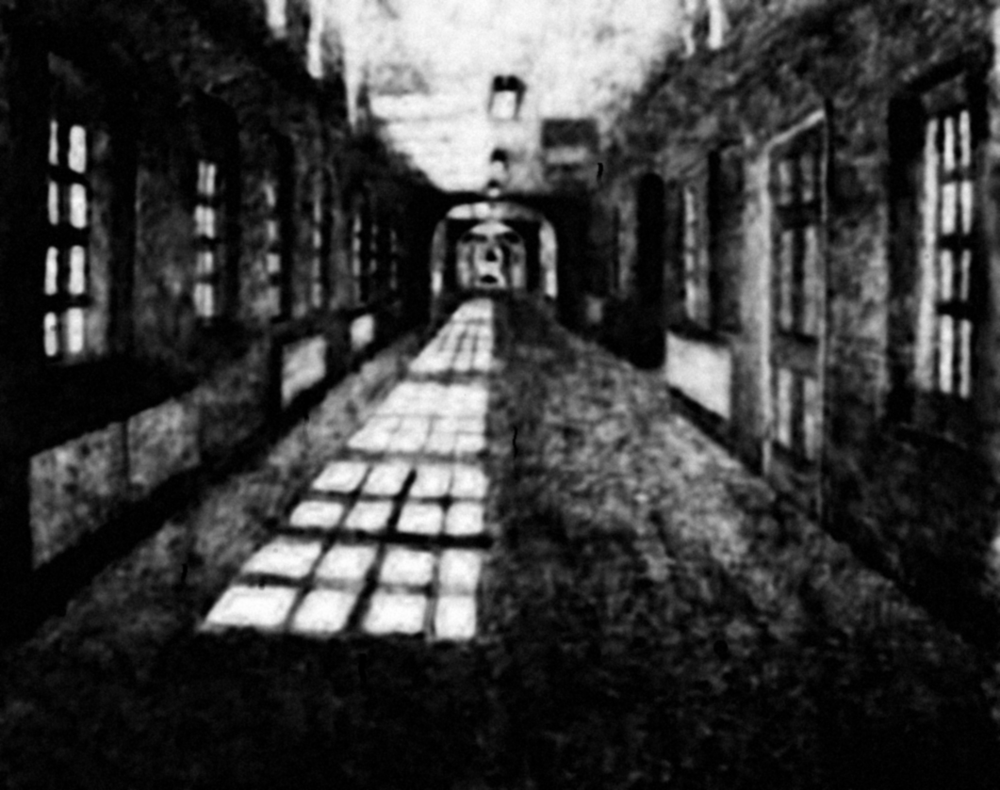

# Gli Archetipi

Scegliete il vostro Archetipo col cuore, non tatticamente. Ognuno rappresenta un modo diverso di affrontare il trauma e contribuisce al gruppo con forze e fragilità uniche. I duplicati sono ammessi.

| Archetipo | Pool Base | Identità |
|:----------|:---------:|:---------|
| [Il Sopravvissuto](archetipi/il-sopravvissuto) | 5 | *«Sono vivo quando altri non lo sono.»* |
| [Il Testimone](archetipi/il-testimone) | 5 | *«Ho visto tutto. Ma la mia mente si chiude.»* |
| [Il Protettore](archetipi/il-protettore) | 4 | *«È stata mia responsabilità. Ho fallito.»* |
| [Il Catalizzatore](archetipi/il-catalizzatore) | 4 | *«È iniziato tutto per colpa mia.»* |

> **Promemoria rapido:** 5–6 = Chiaro · 3–4 = Confuso · 1–2 = Traumatico (+1 Eco) | **Regola d'Oro:** il giocatore alla tua destra interpreta il tuo tiro.

